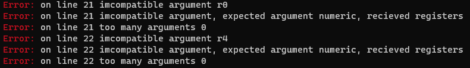

# DASM

DASM is a multiarchitecture portable assembler. You can port your experimental architectures to it, with a simple description file. Right now the syntax of the description files is kinda ugly but it will improve with time. Currently it has no main architecture backend, but im working on a backend for MIPS1.

This is part of a new toolchain that im creating, with similar ideology. C Compiler with single file backends.

# Upcoming
- C Like Structures, with nesting
- x86 Backend
- Moxie Backend
- Support for GNU AS syntax
- RISCV Backend

## Syntax

```
//C like Comments

/*
Multiline Comments
*/

//C Like struct
struct identifier
{
	byte 4, apple;
	byte 4, orange;
	byte 8, lime; 
}

//Access Struct
// struct_identifier.member


//Labels identifier:
main:
     mnemonic operand, operand;
```

## Error Messages

<p align="center">
  
</p>


# Compiling

The assembler needs the following tools: gcc, flex, bison, make

```
make -B ARCH="Your_Arch_Prefix"
```
The default architecture is moxie. So to compile the default architecture do: `make -B`. Then you can test it by doing `./build/bin/dasm test/moxie_test.asm`

After compiling the binary file will be located at `build/bin/`

# The Backend

Each architecture backend requires its own foler at `arch/arch_name`, for example `arch/mips1`.
On the architecture folder, you need to create a file named the same as your architecture, for example `mips.id`.
After creating the instruction description file you can start describing your architecture.

# Description File

Any assembler syntax includes the mnemonic and the operands. As shown in the next table.

| Mnemonic | OP0 | OP1 |
| :---: | :---: | :---: |
| ld | R0 | 0xff |

How we describe such instruction? Well, we first need to let the assembler know our operands. We do so by defining our arguments or operands.

In the following example we define our registers and their address.
```
//Registers
arg registers
{
	(R0){0x00},
	(R1){0x01}
}
```

The definition can be broken into parts.

`arg` This defines an Argument type definition.
`registers` Is just an identifier to identify the set of arguments.
`{` Opens the body of the argument defenition.
`(R1){0x01}` This defines a link. This links `R1` to constant `0x01`.
We can also declare multiple link by separating them with a comma.
`}` At the end we close the definition.


At this point we have just declared what `R0` means, but we havent declarent `ld`(The mnemonic) or `0xff` a value. We dont need to declare what constants are
because the assembler already provides an argument for it, which is the type `numeric`. At this point we declared the operands, we now need to declare the order of those operands and the instruction mnemonic; We do so with instruction description templates.

This is an example of a instruction descriprion tenplate (IDT).

```
def <Instruction Mnemonic> {

    arg_template{
      //Argument Links
    }

    //Constraints on how big can constants be. (Not implemented Yet)
    max {
      //Links to define the constraints
    }
    
    encode {
    "
    //C code for the Instruction Encoding.
    "
    }

    mnemonic {
    "Instruction Mnemonic"
    }
}
```

Then the `ld R0, 0xff` IDT would be like this:

```
def ld {

    arg_template{
      //Argument Links
      (op1){registers}, //Defines OP1 as a Register
      (op2){numeric} //Defines OP2 as a Constant
    }

    //Constraints on how big can constants be. (Not implemented Yet)
    max {
      //Links to define the constraints
    }
    
    encode {
    "
    //C code for the Instruction Encoding.
    "
    }

    mnemonic {
    "ld"
    }
}
```

This is one of the most important parts of an IDT, the op1 and op2. Dont actually define the order of the operands, they define a way to link multiple argument names into a single operand. The part that defines the order of the operands is actually the order on how they are declared. For example in the next example, the register operand will go first and the numeric operand go second.

```
    arg_template{
      //Argument Links
      (op1){registers}, //Defines OP1 as a Register
      (op2){numeric} //Defines OP2 as a Constant
    }
```

## Enconding
One of the internal components of an IDT is the encode scope  `encode {""}`, after the assembler matches the IDTs by using the `arg_template` (Argument Template) declaration on each IDT. It then will execute the C code on the `encode` scope. The encode scope is a way for the programmer to have more flexibility on how the instruction will be encoded and on how it will be stored.

```
    encode {
    "
    //C code for the Instruction Encoding.
    "
    }
```

The backend generator will generate a similar function as the next example.

```c
void addu_encode_function(BIN_BUFFER* bin_buffer, ARG_TABLE* arg_table, int op)
```

The code inside of the encode scope will be allocated on a function with the same arguments. The `bin_buffer` is the output buffer for the assembler. Here is were all the assembled instruction will be stored into. The `arg_table` argument is an struct that contains all the operand values. And the `op` is like an unique ID for each instruction.
Accesing each structure to assemble the instruction can get complicated, so there are macros to help access such structures, defined in arg_access.h

Now we know that some instructions use the same encoding squeme, and to make it easier to do instruction encoding we use MACROS. Defining macros can be done somewhere on the instruction desciprion file. By doing:
```
macros 
{"
  //These are C macros
    #define I_ADDU	            0b100001
    #define I_ADD	              0b100000
    #define I_ADDIU	            0b001001
"}
```


By using macros the encode scope can look something like this:

```
encode 
{
"
  //We refer to this macros as "Arg Access Macros" defined in arg_access.h
  APPEND_BYTE(GET_SIZE_32_SEC_1(ENCODE_R(I_ADDU, GET_OP1_VAL, GET_OP2_VAL, GET_OP3_VAL, 0x00, 0x00)));
  APPEND_BYTE(GET_SIZE_32_SEC_2(ENCODE_R(I_ADDU, GET_OP1_VAL, GET_OP2_VAL, GET_OP3_VAL, 0x00, 0x00)));
  APPEND_BYTE(GET_SIZE_32_SEC_3(ENCODE_R(I_ADDU, GET_OP1_VAL, GET_OP2_VAL, GET_OP3_VAL, 0x00, 0x00)));
  APPEND_BYTE(GET_SIZE_32_SEC_4(ENCODE_R(I_ADDU, GET_OP1_VAL, GET_OP2_VAL, GET_OP3_VAL, 0x00, 0x00)));
"
}
```

# Types of Arg Access Macros

## Bin Buffer Access

```c
#define APPEND_BYTE(byte) append_byte(bin_buffer, byte)
```

## Operand Access

```c
//Access The operand
#define GET_OP1 arg_table->data[0]
//Access Value from operand
#define GET_OP1_VAL arg_table->data[0].value
//Acess Name from operand
#define GET_OP1_NAME arg_table->data[0].name
//Access Domain from operand
#define GET_OP1_DOMAIN arg_table->data[0].domain
```

## Argument Domains

```c

#define REGISTER "register"
#define NUMERIC "numeric"
#define ADDRESS "address"
```

# Misc

To enable debuging the macro `_DEBUG_` has to be defined in the file `debug.h`

